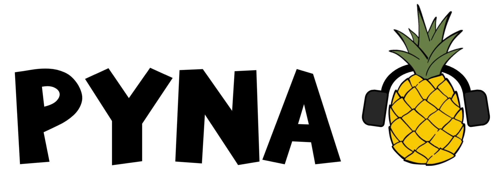

# What is pyNA?

**pyNA** is the *python Noise Assessment* tool to assess the noise footprint of aircraft engines. The tool estimates the mean-square acoustic pressure level for different engine noise sources, propagates the source noise to an observer on the ground and calculates the noise levels as defined in ICAO Annex 16 Environmental Protection, Volume I: Aircraft Noise.


# Documentation

The online documentation of **pyNA** is available at https://mit-lae.github.io/pyNA/.


# Installation

Get pyNA from a cloned repository from Github: 

```
git clone git@github.com:MIT-LAE/pyNA.git
```

Change into the pyNA directory and install the package:

```
pip install -e .
```


# Citation

If you use pyNA in your work, please cite:

````
```
@unpublished{Voet2022,
  author = {Laurens J. A. Voet and Prashanth Prakash and Raymond L. Speth and Jayant S. Sabnis and Choon S. Tan and Steven R. H. Barret},
  title = {Sensitivities of aircraft acoustic metrics to engine design and control variables for multi-disciplinary optimization},
  journal = {AIAA Journal (manuscript under review)},
  year = {2022},
}
```
````

